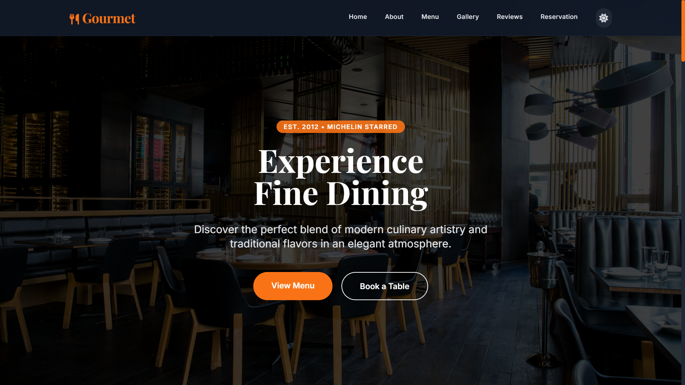

# 🍽️ Frontend Restaurant Website

Welcome to the **Frontend Restaurant Website** project — a modern, responsive, and visually appealing restaurant landing page designed to showcase food, services, and restaurant branding. 

This project focuses on delivering an elegant user experience with beautiful layouts, engaging animations, and a fully responsive design.

---

## 🖼️ Preview



---

## 🎯 Purpose

This project demonstrates the creation of a modern restaurant website with a focus on responsive design, user experience, and attractive visual presentation.

---

## ✨ Key Features

### 🎨 Modern Restaurant Design

- **Elegant UI:** Professional, restaurant-themed user interface.
- **Visual Presentation:** Modern typography and attractive, premium color schemes.

### 📱 Fully Responsive Layout

- **Mobile-First:** Mobile-friendly design optimized for all devices.
- **Cross-Platform:** Ensures a smooth experience across tablets, laptops, and desktops.

### 🍔 Food Menu & Gallery

- **Categorized Menus:** Beautiful food card layouts featuring categorized dishes and pricing.
- **Interactive Gallery:** High-quality food showcase with responsive image grids and interactive hover effects.

### 📅 Table Reservation & Contact

- **Booking Interface:** User-friendly reservation form with date and time selection.
- **Location Sync:** Contact information, restaurant address, and Google Maps integration.

### 🌙 Dynamic Theming & Animations

- **Dark/Light Mode:** Theme switching support with automatic system preference detection.
- **Smooth Animations:** Engaging scroll animations, smooth hover effects, and interactive transitions.

### 👨‍🍳 About & Social Proof

- **Our Story:** Restaurant mission and chef introduction section.
- **Testimonials:** Modern testimonial cards displaying customer reviews and ratings.

---

## 📂 Website Sections

The landing page is logically divided into the following sections for seamless navigation:

- **Home**
- **About**
- **Menu**
- **Special Dishes**
- **Gallery**
- **Testimonials**
- **Reservation**
- **Contact**

---

## 🛠️ Technologies Used


- **Responsive Design Principles**

---

## ⚙️ Quick Start & Installation 📥

Follow these simple steps to view the project locally:

1. **Clone the Repository:**

```bash
   git clone https://github.com/iqbolshoh/frontend-restaurant.git
```

2. **Navigate to the Directory:**

```bash
   cd frontend-restaurant
```

3. **Run the Project:**

- Open `index.html` directly in your browser.
- Or use the **Live Server** extension in VS Code for live reloading.

---

## 🖥 Technologies Used


## 📜 License

This project is open-source and available under the **MIT License**.

## 🤝 Contributing

🎯 Contributions are welcome! If you have suggestions or want to enhance the project, feel free to fork the repository and submit a pull request.

## 📬 Connect with Me

💬 I love meeting new people and discussing tech, business, and creative ideas. Let’s connect! You can reach me on these platforms:

<div align="center">
  <table>
    <tr>
      <td>
        <a href="https://iqbolshoh.uz" target="_blank">
          
        </a>
      </td>
      <td>
        <a href="mailto:iilhomjonov777@gmail.com" target="_blank">
          
        </a>
      </td>
      <td>
        <a href="https://github.com/iqbolshoh" target="_blank">
          
        </a>
      </td>
      <td>
        <a href="https://www.linkedin.com/in/iqbolshoh/" target="_blank">
          
        </a>
      </td>
      <td>
        <a href="https://t.me/iqbolshoh_777" target="_blank">
          
        </a>
      </td>
      <td>
        <a href="https://wa.me/998997799333" target="_blank">
          
        </a>
      </td>
      <td>
        <a href="https://instagram.com/iqbolshoh_777" target="_blank">
          
        </a>
      </td>
      <td>
        <a href="https://x.com/iqbolshoh_777" target="_blank">
          
        </a>
      </td>
      <td>
        <a href="https://www.youtube.com/@Iqbolshoh_777" target="_blank">
          
        </a>
      </td>
    </tr>
  </table>
</div>
